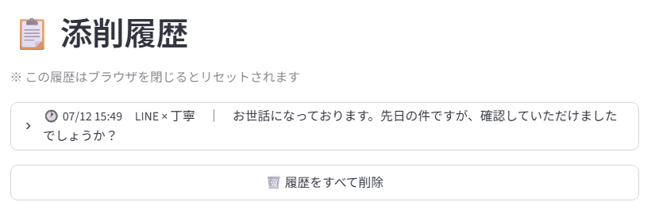

# 伝わる文章添削ツール

LINE・メール・報告文を、用途と希望するトーンに合わせてAIが添削するWebアプリです。

[作品一覧](https://github.com/moedaichi0629-ai/landing-page) · [ポートフォリオ](https://moedaichi0629-ai.github.io/landing-page/)

## 解決する課題

**想定利用者：** 送信前に文章の表現を整えたい利用者

丁寧さや伝わりやすさを考えながら文面を直す手間。

## 主な機能

- 用途・トーンに合わせた添削
- 変更理由・相手に与える印象・別案の表示
- セッション内の添削履歴

## デモ・利用方法

[デモ](https://writing-correction-tool-mygnto9hpkyehkzquhma9q.streamlit.app)。休止後の起動には時間がかかる場合があります。

## 使用技術

Python / Streamlit / OpenAI API

## 工夫した点

修正文だけでなく変更理由も表示し、スマートフォンで使いやすい入力画面にしています。

## セットアップ・技術詳細

<details>
<summary>操作方法・構成・設定手順などの詳細を開く</summary>

LINE・メール・報告文など、送る前の文章をAIに添削してもらえるWebアプリです。

---

## 目次

1. [アプリ概要](#アプリ概要)
2. [アプリURL](#アプリurl)
3. [スクリーンショット](#スクリーンショット)
4. [主な機能](#主な機能)
5. [使用技術](#使用技術)
6. [セットアップ方法](#セットアップ方法)
7. [ディレクトリ構成](#ディレクトリ構成)
8. [工夫した点](#工夫した点)

---

## アプリ概要

「この言い方で失礼にならないかな」「もっと簡潔にできないかな」と迷う文章を、送る前にAIへ添削してもらうツールです。

文章と「用途」「希望するトーン」を選んでボタンを押すだけで、AIが

- 修正文
- 変更した理由
- 相手に与える印象
- 別パターン案（丁寧版・短め版など）
- そのままコピペできる完成文

をまとめて提案してくれます。スマホでの入力を想定してUIを調整しており、外出先からLINEやメールの文面をその場で整えられます。

---

## アプリURL

**デモ:** https://writing-correction-tool-mygnto9hpkyehkzquhma9q.streamlit.app

> Streamlit Cloudの無料枠でホスティングしているため、しばらくアクセスがないとスリープします。初回アクセス時は起動に数十秒かかることがあります。

---

## スクリーンショット

### 入力フォーム
文章・用途・トーンを選んで添削を依頼する画面。


### 添削結果
修正文・変更理由・相手に与える印象・別パターン案・コピペ用完成文をまとめて表示。


### 添削履歴
過去の添削結果を一覧で振り返れる。



---

## 主な機能

- **文章添削** — OpenAI API（GPT-4o mini）による添削。誤字脱字・分かりにくい表現・TPO・失礼にあたる表現などを総合的にチェック
- **用途に合わせた添削** — LINE / メール / 報告文 / 依頼文 / お礼文 / SNS投稿 から選択
- **トーン指定** — 丁寧 / やわらかい / 短く / ビジネス向け / 親しみやすい から選択
- **複数パターン提案** — 丁寧版・短め版・やわらかい版など、用途に応じた別案も一緒に表示
- **添削履歴** — セッション中の添削結果を一覧表示し、あとから見返せる（全件削除も可能）
- **スマホ対応UI** — 入力欄・ボタンのサイズやフォントをスマホ向けに最適化（iOSでの自動ズームも防止）
- **エラーハンドリング** — APIキー未設定・認証エラー・利用制限・通信エラーをそれぞれ分かりやすいメッセージで表示

---

## 使用技術

| カテゴリ | 技術 |
|---|---|
| 言語 | Python 3.10+ |
| UIフレームワーク | Streamlit |
| AI | OpenAI API（GPT-4o mini） |
| ホスティング | Streamlit Cloud |

---

## セットアップ方法

```bash
# リポジトリをクローン
git clone https://github.com/moedaichi0629-ai/writing-correction-tool.git
cd writing-correction-tool

# 依存パッケージをインストール
pip install -r requirements.txt

# 環境変数を設定
# .envファイルを作成し、OPENAI_API_KEY を設定する

# アプリを起動
streamlit run app.py
```

ブラウザで `http://localhost:8501` が自動的に開きます。

---

## ディレクトリ構成

```
writing-correction-tool/
├── app.py            # Streamlitアプリ本体（UI・添削処理）
├── requirements.txt  # 依存パッケージ
└── README.md
```

---

## 工夫した点

- 添削結果を「修正文」だけでなく「変更理由」「相手に与える印象」まで返すことで、なぜその直しが必要かが分かるようにした
- 用途・トーンをセレクトボックス化し、毎回プロンプトを書かずに使えるようにした
- スマホからの利用を想定し、入力欄のフォントサイズやボタンサイズを個別に調整した

## 注意事項

`.env` には OpenAI APIキーが含まれるため、リポジトリには含まれていません。各自で取得・設定してください。

</details>

